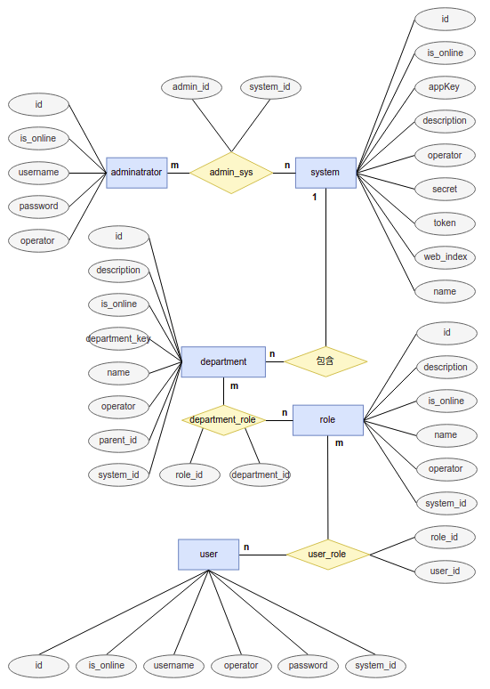

# doberman
统一权限管理系统，对外提供同意的权限管理系统，同时支持多语言客户端

## 数据库ER图设计

**关系模式**

1. 系统管理员(adminarator): 管理员id, 用户名
2. 系统(system): 系统id, 系统信息
3. 部门(apartment): 部门id, 系统id, 部门其他信息
4. 角色(role): 角色id, 角色其他信息
5. 用户(user): 用户id, 用户其他信息
6. 系统管理员-系统(admin-sys): 管理员id, 系统id
7. 部门-角色(apartment-role): 部门id, 角色id
8. 用户-角色(user-role): 用户id, 角色id

其中, 红色字段为表的主键, 蓝色为表的外键